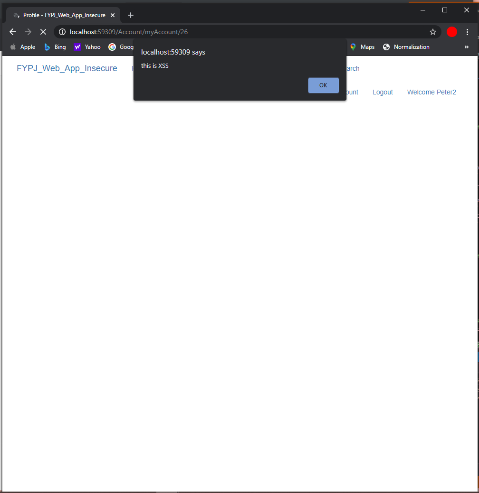
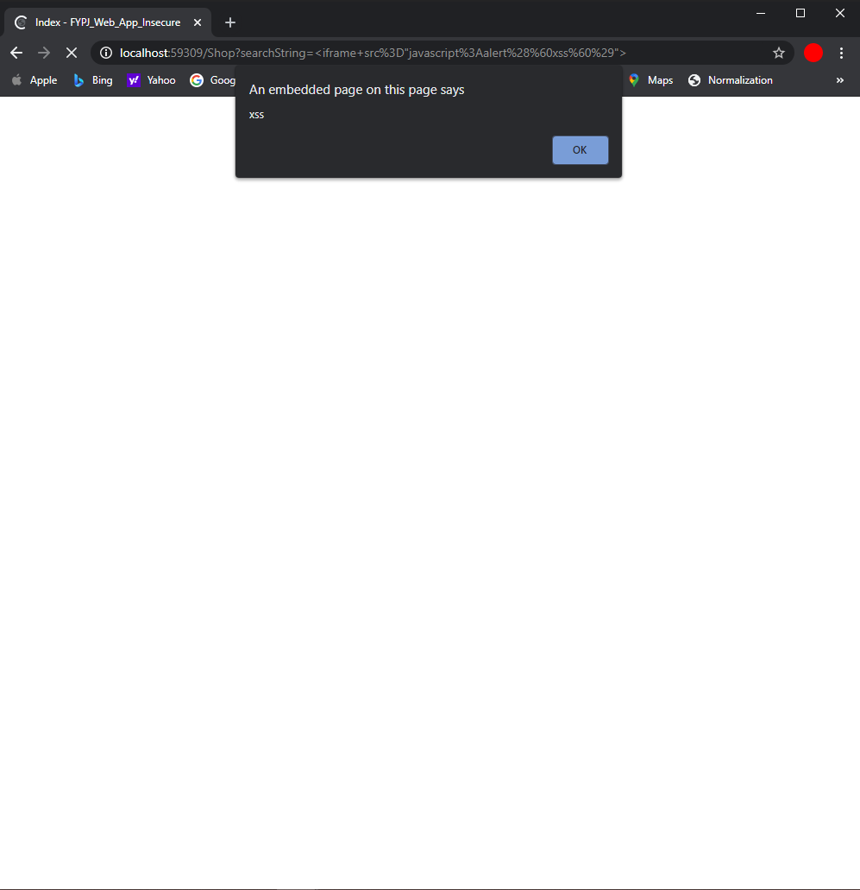
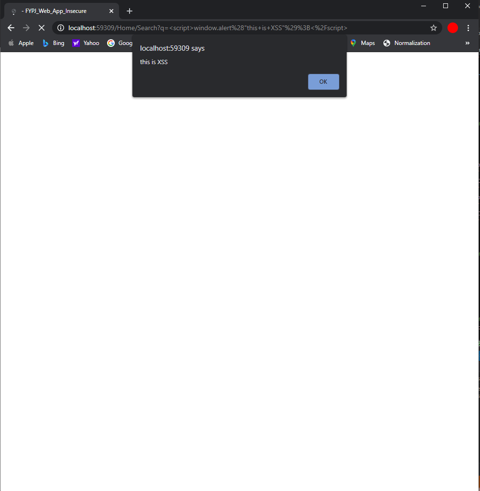
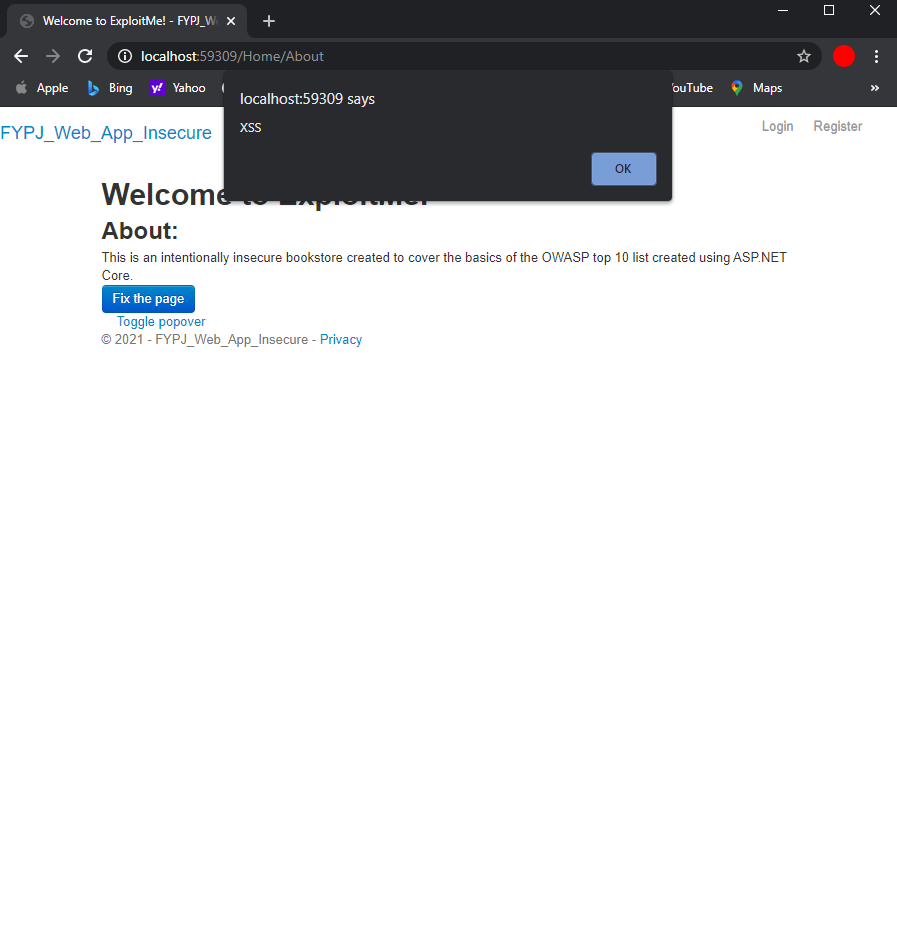
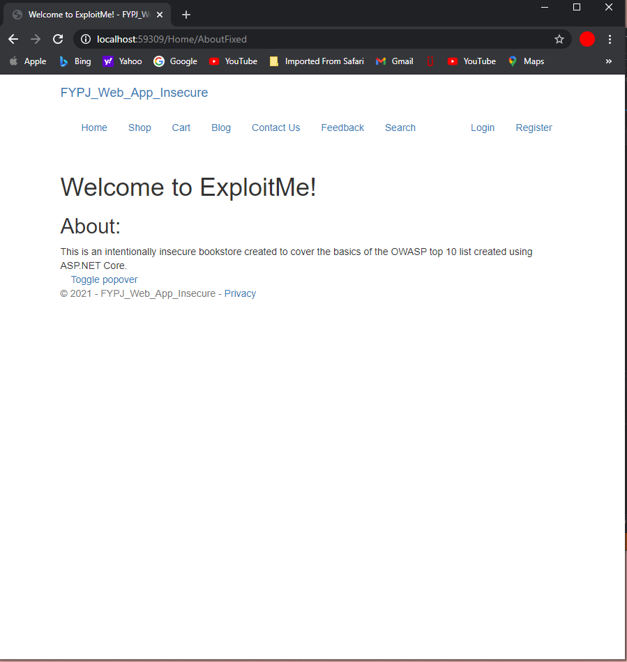

# Welcome to ExploitMe!
## The most vulnerable web application tool for training purposes

---

#### In this web application, it covers the basics of the OWASP top 10 list created using ASP.NET Core.
#### The OWASP top 10 vulnerabilities included in this web application are:

* SQL Injection
* Broken Authentication
* Sensitive Data Exposure
* XML External Entities (XXE)
* Broken Access Control
* Security Misconfiguration
* Cross-Site Scripting (XSS)
* Insecure Deserialization
* Using Components with known vulnerabilities
* Insufficient Logging & Monitoring
---
#### Requirements
1. .NET Core Version 3.1 
2. OWASP ZAP https://www.zaproxy.org/download/
3. Docker 
4. Git https://git-scm.com/downloads
5. Linux Kernel https://docs.microsoft.com/en-us/windows/wsl/install-win10#step-4---download-the-linux-kernel-update-package
---

#### Running and Building
##### Visual Studio
1. Clone the repository https://github.com/Sytechia/Exploit_me.git using Visual Studio
2. Open the file in Visual Studio and run it

##### Docker
1. Clone the repository https://github.com/Sytechia/Exploit_me.git
2. Go to the directory of the folder.    
2. Build the app <br />
   `docker build -t myapp .`
3. Run the web app for the first time <br />
   `docker run -d -p 8080:80 --name myapp myapp`
4. Stop the app to move the database file from the folder to the container <br />
   `docker stop myapp`
5. Go into the location of the database file <br />
   `cd Exploit_Me`
6. Copy the file over <br />
   `docker cp database.db myapp:/app/database.db`
7. Start the container <br />
   `docker start myapp`
8. Go to `localhost:8080` <br />
   Or<br />
   Type `ipconfig` into the command prompt to check for your IP address. The url would be `<your ipv4 address>:8080`

---

#### Troubleshooting
##### Docker command not recognized 
Install Docker Desktop <br />
https://docs.docker.com/docker-for-windows/install/
##### Docker WSL 2 not installed
Install linux kernel <br />
https://docs.microsoft.com/en-us/windows/wsl/install-win10#step-4---download-the-linux-kernel-update-package
##### Windows Subsystem not enabled
1.  Open PowerShell as Administrator and run:
`dism.exe /online /enable-feature /featurename:Microsoft-Windows-Subsystem-Linux /all /norestart`
2.  Restart PC.


### Tutorial (Recommended answers)
#### SQL Injection
Introduction: SQL injection is a web security vulnerability that allows an attacker to interfere with the queries that an application makes to its database. It generally allows an attacker to view data that they are not normally able to retrieve. This might include data belonging to other users, or any other data that the application itself is able to access. In many cases, an attacker can modify or delete this data, causing persistent changes to the application's content or behavior.

In some situations, an attacker can escalate an SQL injection attack to compromise the underlying server or other back-end infrastructure, or perform a denial-of-service attack.

In our web application, most of the input boxes can be SQL injected. The reason for this is because, the input boxes are not filtered, allowing for any kinds of malicious input to be sent the backend. The SQL queries are also not parameterized allowing for the extraction of data from the database.

##### Login to the first account in the database

For Example, create an account and login with that account. When you log in with your credentials, it will query the database with:

> SELECT * FROM Customer WHERE Username = '\<Your username\>' and Pwd = '\<Your Password\>'

As you can see we can exploit the database with our own SQL syntax by injecting into the Username and Pwd fields.

Logout and login with `' or '1' = '1' --` as the Username and Password. It will query the database with:

> SELECT * FROM Customer WHERE Username='' or '1' = '1' --' and Pwd='' or '1' = '1' --'

If we analyse the SQL statement that we just entered, the first `'` is to close the Username statement and `or` is to allow the next statement to go through if the first matching statement does not return true. In SQL, Since `'1' = '1'` is always true, it will be counted as a valid statement and hence will return the very first matching statement, in this case the very first user in our database.

##### Login to Peter's Account

We can also log in to any user account that we want just by simple entering `<username>'--` into the username field as `--` will comment the remaining query, in this case it will comment out the remaining query of `and Pwd = '\<Your Password\>'`. For example if we were to enter `admin'--` into the username field and `anything` as password, we can login into the admin account. The resulting query will be:

> SELECT * FROM customer WHERE Username='admin'--'
##### Delete Marley from the database
Deleting users from the database is simple, all we have to do is just enter `<any username>';Delete from customer where username='<username that you want to delete>';--`, this will execute the first statement of finding the user and also execute the second statement of deleting the user from the database.
#### Broken Access Control
Introduction: Application functions related to authentication and session management are often implemented incorrectly, allowing attackers to compromise passwords, keys, or session tokens, or to exploit other implementation flaws to assume other users’ identities temporarily or permanently.

In this part of the tutorial, we will be leveraging on the OWASP ZAP! tool to intercept requests and response to and from our web application. 
##### Go to admin page without using admin's account
1.  Open OWASP ZAP!
2.  Run the web application and copy the URL of the web application.
3.  Select Manual Explore so that we can manually type the URL that we want to intercept.

4.	Paste the URL into the search box and click Launch Browser, make sure Firefox is selected.

5.	The browser will launch through ZAP! and from here on we can start to see all requests and responses.
6.	Click the history tab. The history tab as the name implies, shows all the links that we have opened when the zap session is launched.
     
7.	Go to the Login page on our web application, if you go back to the ZAP! tool, you will see that the link that we just click has also been recorded on ZAP!. <br />
8.  Register for an account and login to that account. Open up The Browser's inspector tool using right and inspect element anywhere on the web page. <br />
9.  Click on the Storage tab and go to the cookies panel, notice how the <code>user_id</code> cookie is a number and is shown in plain text. Lets exploit it. <br />
    
10.	Click on the Break tool at the top, what this does is that for every requests and response, we must manually step down to forward the requests or to drop the requests, it allows us to see all the data that is being sent to the server.
    
11. Login to the same account again, but this time something will popup when you click login. As mentioned previously, all the data that is sent to the server can be seen over here and can also be modified.
    
12. Click step to go through to the next request, notice how there is a <code>Set-Cookie</code> field with the user_id of 20, that is our user_id but what if we changed to 1?
    
13. Keep clicking on the step button to move on with the requests and response. Open up the inspector and go to the Cookies panel, notice that our <code>user_id</code> is now 1 instead of 20, we have successfully changed our user_id to that of the Admin.
    
14. Click on <code>Continue</code> if the request/response tab appears again and now type <code>/admin/admin</code> into the URL, we have now successfully entered the Admin's page even though we are still logged in as our own account.
##### Add more items to another user's cart
1.  Similar to changing admin's cookie id in the previous step, we need to change the id cookie of whom we want to add the item for another user's cart.
2.  Lets say we changed the user id cookie to 1, when we add the cart for user id of 20 we are actually adding to user id 1 shopping cart
#### Broken Authentication
For Broken Authentication, we will be using brute force attack to identify the password of a user.
Firstly we will need to download the most common password list from https://github.com/danielmiessler/SecLists/blob/master/Passwords/Common-Credentials/10-million-password-list-top-1000.txt
##### Using Brute Force, find Dylan's Credentials
1.  Run OWASP ZAP with the url of our application as explained in broken access control
2.  Login with `Dylan` as the username and with any password.
3.  Click Login.
4.  Go to ZAP! and identify the history link for which you have logged in the credentials with.

5.  Highlight the password and right click > Fuzz

6.  Click payloads > Add > Change type to file > Select the most common password file <br />
7.  Click Ok and go to the options tab, make sure follow redirects is selected and click start Fuzzer. <br />
8.  ZAP will now use the password provided in the .txt file to see if any passwords are valid with the user Dylan. <br />
9.  Scroll through the list and do you notice anything different in any of the passwords? <br />
10. Notice that one of the Size Response Body has a different size than the rest, lets assume that the password associated is the correct one lets try it 

11. Login with `Dylan` and the password that you found out using ZAP <br />
12. Success! That was an example of broken authentication

#### Reset Bender's password via the Forgot Password mechanism with the original answer to his security question. 
For this challenge, users must research on who Bender is online and find the answer to his original question in forget password, for reference the answer is gold. <br />

#### XXE
XXE can also be done in our web application as it contains a XML parser.
In this example, we will do Billion Laughs attack to increase the system usage. <br />
1.  Run OWASP ZAP with the url of our application as explained in broken access control <br />
2.  Go to https://localhost:5001/Xml <br />
3.  Intercept the requests of the web application using ZAP <br />
4.  Next, we need to decode the billion laughs syntax into url encoded format, we need to change from <br />

```xml
<!DOCTYPE lolz [
 <!ENTITY lol "lol">
 <!ELEMENT lolz (#PCDATA)>
 <!ENTITY lol1 "&lol;&lol;&lol;&lol;&lol;&lol;&lol;&lol;&lol;&lol;">
 <!ENTITY lol2 "&lol1;&lol1;&lol1;&lol1;&lol1;&lol1;&lol1;&lol1;&lol1;&lol1;">
 <!ENTITY lol3 "&lol2;&lol2;&lol2;&lol2;&lol2;&lol2;&lol2;&lol2;&lol2;&lol2;">
 <!ENTITY lol4 "&lol3;&lol3;&lol3;&lol3;&lol3;&lol3;&lol3;&lol3;&lol3;&lol3;">
 <!ENTITY lol5 "&lol4;&lol4;&lol4;&lol4;&lol4;&lol4;&lol4;&lol4;&lol4;&lol4;">
 <!ENTITY lol6 "&lol5;&lol5;&lol5;&lol5;&lol5;&lol5;&lol5;&lol5;&lol5;&lol5;">
 <!ENTITY lol7 "&lol6;&lol6;&lol6;&lol6;&lol6;&lol6;&lol6;&lol6;&lol6;&lol6;">
 <!ENTITY lol8 "&lol7;&lol7;&lol7;&lol7;&lol7;&lol7;&lol7;&lol7;&lol7;&lol7;">
 <!ENTITY lol9 "&lol8;&lol8;&lol8;&lol8;&lol8;&lol8;&lol8;&lol8;&lol8;&lol8;">
]>
<lolz>&lol9;</lolz>
```
to
<br>
```
%3C!DOCTYPE%20lolz%20%5B%0A%20%3C!ENTITY%20lol%20%22lol%22%3E%0A%20%3C!ELEMENT%20lolz%20(%23PCDATA)%3E%0A%20%3C!ENTITY%20lol1%20%22%26lol%3B%26lol%3B%26lol%3B%26lol%3B%26lol%3B%26lol%3B%26lol%3B%26lol%3B%26lol%3B%26lol%3B%22%3E%0A%20%3C!ENTITY%20lol2%20%22%26lol1%3B%26lol1%3B%26lol1%3B%26lol1%3B%26lol1%3B%26lol1%3B%26lol1%3B%26lol1%3B%26lol1%3B%26lol1%3B%22%3E%0A%20%3C!ENTITY%20lol3%20%22%26lol2%3B%26lol2%3B%26lol2%3B%26lol2%3B%26lol2%3B%26lol2%3B%26lol2%3B%26lol2%3B%26lol2%3B%26lol2%3B%22%3E%0A%20%3C!ENTITY%20lol4%20%22%26lol3%3B%26lol3%3B%26lol3%3B%26lol3%3B%26lol3%3B%26lol3%3B%26lol3%3B%26lol3%3B%26lol3%3B%26lol3%3B%22%3E%0A%20%3C!ENTITY%20lol5%20%22%26lol4%3B%26lol4%3B%26lol4%3B%26lol4%3B%26lol4%3B%26lol4%3B%26lol4%3B%26lol4%3B%26lol4%3B%26lol4%3B%22%3E%0A%20%3C!ENTITY%20lol6%20%22%26lol5%3B%26lol5%3B%26lol5%3B%26lol5%3B%26lol5%3B%26lol5%3B%26lol5%3B%26lol5%3B%26lol5%3B%26lol5%3B%22%3E%0A%20%3C!ENTITY%20lol7%20%22%26lol6%3B%26lol6%3B%26lol6%3B%26lol6%3B%26lol6%3B%26lol6%3B%26lol6%3B%26lol6%3B%26lol6%3B%26lol6%3B%22%3E%0A%20%3C!ENTITY%20lol8%20%22%26lol7%3B%26lol7%3B%26lol7%3B%26lol7%3B%26lol7%3B%26lol7%3B%26lol7%3B%26lol7%3B%26lol7%3B%26lol7%3B%22%3E%0A%20%3C!ENTITY%20lol9%20%22%26lol8%3B%26lol8%3B%26lol8%3B%26lol8%3B%26lol8%3B%26lol8%3B%26lol8%3B%26lol8%3B%26lol8%3B%26lol8%3B%22%3E%0A%5D%3E%0A%3Clolz%3E%26lol9%3B%3C%2Flolz%3E
```

<br>
5.  Paste it like so
    
6.  Watch as the memory of the application increases in task manager <br>
7.  XXE Injection completed

##### Retrieve the content of C:\Windows\system.ini or /etc/passwd from the server.
By using XXE injection, we can also even get system information and get private information
1.  As usual, we will need to intercept the request between the host and the server using ZAP.
2.  The instructions are similar to XXE but instead of changing the into Billion Laughs XML, we change it like so:

`For Linux`
```xml
%3C%3Fxml%20version%3D%221.0%22%20encoding%3D%22UTF-8%22%3F%3E%0A%3C!DOCTYPE%20foo%20%5B%20%3C!ENTITY%20xxe%20SYSTEM%20%22file%3A%2F%2F%2Fetc%2Fpasswd%22%3E%20%5D%3E%0A%3CstockCheck%3E%3CproductId%3E%26xxe%3B%3C%2FproductId%3E%3C%2FstockCheck%3E
```
`For Windows`
```xml
%3C%3Fxml%20version%3D%221.0%22%20encoding%3D%22UTF-8%22%3F%3E%0A%3C!DOCTYPE%20foo%20%5B%20%3C!ENTITY%20xxe%20SYSTEM%20%22file%3A%2F%2F%2FC%3A%2FWindows%2Fsystem.ini%22%3E%20%5D%3E%0A%3CstockCheck%3E%3CproductId%3E%26xxe%3B%3C%2FproductId%3E%3C%2FstockCheck%3E
```
3.  We can then get whatever information that was in C:\Windows\system.ini or /etc/passwd


#### Sensitive Data Exposure
In terms of sensitive data exposure, we have implemented it in such that routes are exposed and students can use it to explore routes that are not suppose to be accessed.

1.  By going to `/routes`, it will display all the available routes that is in our webpage.
2.  From here, students can deduce that by exploring specific routing pages, they will be able to complete the rest of the challenges in the sensitive data exposure section.
3.  The method of finding `/routes` is hidden but by logging into admin account they can find it.
4.  For documentation purposes, the hidden routes which will fulfill the challenges are `/admin`,`/download_database` and `/logs`

#### Security Misconfiguration
Security misconfiguration is commonly a result of things such as insecure default configurations, unprotected files and directories, verbose error messages containing sensitive information and misconfigured HTTP headers. These are the things covered in our application.

1. The default account for admin is enabled in the application. When the user tries to login with username: admin and password: admin, they will be able to access the admin page and view all of the sensitive user data.
2. The directory listing in our web application is enabled. By going into `/files`, all the static files in the webpage will be displayed and can be accessed.
3. When the user tries to see the top users of the month, they will encounter an error page that reveals a stack trace which is overly informative.
4. 

#### Cross Site Scripting (XSS)
Cross-Site Scripting (XSS) attacks are a type of injection, in which malicious scripts are injected into otherwise benign and trusted websites. 
##### Carry out an XSS attack in the Blog (Stored XSS)
1. Go into the Blog.
2. Navigate to Respond under one of the blog posts.
3. Paste the attack string `<iframe src="javascript:alert(`xss`)">` into the text box and click Submit Response.
4. This causes the attack string to be stored in the database.
5. Refresh that URL to get the XSS payload executed.
 

##### Find a way to do an XSS attack in the my account page (Stored XSS)
1. Log in as any user.
2. To check the account details go into My Account.
3. Navigate to Edit Profile.
4. Paste the attack string `<script>window.alert("this is XSS");</script>` into the Username textbox and submit it.
5. This causes the attack string to be stored in the database.
6. Everytime the user navigates back into MyAccount the XSS will be executed.


##### XSS attack in search function(DOM XSS)
1. Paste the attack string `<iframe src="javascript:alert(`xss`)">` into the Search field.
2. Click the Search button.
3.An alert box with the text "xss" should appear.


##### XSS attack in the shop page(Reflected XSS)
1. Go to the Shop page.
2. Try searching for a book in the filter function.
3. Notice the searchString parameter in the URL `http://localhost:59309/Shop?searchString=the` with `the` being the word you searched?
4. Since the word searched is displayed, it might be prone to an XSS attack.
5. Paste the attack string `<script>window.alert("this is XSS");</script>` into the URL.
6. Refresh that URL to get the XSS payload executed 


#### Using Components with Known Vulnerabilities

##### Vulnerable library No.1 (Bootstrap) 
1. Go to the About Page.
2. When you go in you will encounter a popup that says "XSS". This is an example of an XSS attack.

3. Now click on the button there to fix the page. Notice that the popup is gone.

4. Both pages have the exact code so what is the difference?
5. The difference between both codes is that the About page makes use of an older version of bootstrap whereas the fixed About page makes use of a newer version. Older versions of bootstrap after vulnerable to things such as XSS while the newer versions are not vulnerable to them. Therefore, About page is able the execute the XSS attack whereas AboutFixed is not able to execute the attack.

##### Vulnerable library No.2 (Jquery) 
1. Now we are going to refer back to the XSS vulnerability in the myAccount page
2. Similar to bootstrap, older versions of jquery are vulnerable to attacks.
3. If you inspect the code for the edit account page, you will see that the page is making use of an older version od jquery.
4. This makes it vulnerable to the XSS attack that was carried out earlier.

#### Insufficient Logging & Monitoring
1. Check the console or download the logs file while you are navigating through the website 
2. You will notice that there is very limited information being logged and this will help attackers achieve what they want to do without being detected
